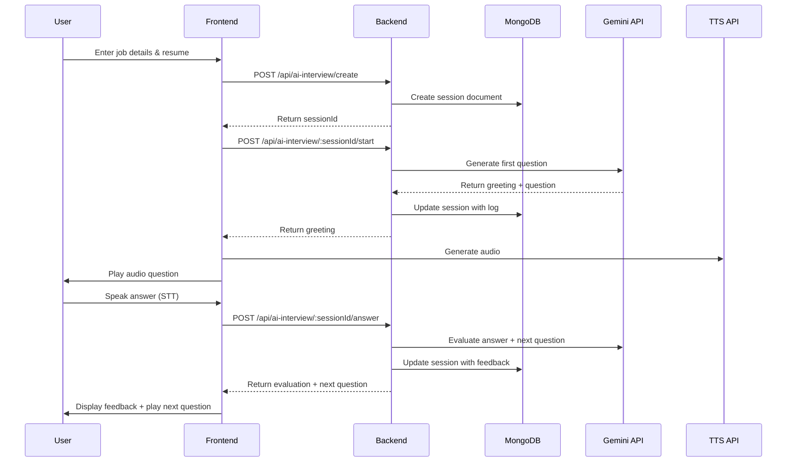

# AI Interview Simulator - MongoDB Integration

## Overview

The AI Interview Simulator is a real-time, conversational interview practice system that uses:

- **MongoDB** for session storage and state management
- **Google Gemini API** for AI-powered conversation and text-to-speech
- **Web Speech API** for speech recognition (STT)
- **Polling** for real-time updates (alternative to Firebase)

## Architecture

### Backend Components

1. **Model**: `backend/models/AIInterviewSession.js`

   - MongoDB schema for storing interview sessions
   - Fields: user, jobDetails, interviewType, state, log, evaluation, metadata
   - Methods: `addLogEntry()`, `updateState()`, `getActiveSession()`, `getRecentSessions()`

2. **Routes**: `backend/routes/aiInterview.js`
   - `POST /api/ai-interview/create` - Create new interview session
   - `POST /api/ai-interview/:sessionId/start` - Start interview and get first question
   - `POST /api/ai-interview/:sessionId/answer` - Submit answer and get feedback
   - `GET /api/ai-interview/:sessionId` - Get current session state
   - `GET /api/ai-interview/active/current` - Get active session for user
   - `GET /api/ai-interview/history/all` - Get interview history
   - `POST /api/ai-interview/:sessionId/reset` - End/reset session
   - `POST /api/ai-interview/tts/generate` - Generate speech from text

### Frontend Component

**Component**: `src/components/AIInterviewSimulator.tsx`

Features:

- ✅ Three-state UI: setup → in-progress → feedback
- ✅ Speech Recognition (microphone input)
- ✅ Text-to-Speech (AI interviewer speaks)
- ✅ Real-time chat interface with speaker-specific styling
- ✅ Auto-scroll to latest message
- ✅ Integration with existing UI design system (shadcn/ui)

### Workflow



## Setup Instructions

### 1. Backend Setup

The backend routes are already integrated into `server.js`. Ensure your `.env` file contains:

```env
# Gemini API Configuration
GEMINI_API_KEY=your_gemini_api_key_here
```

Get your Gemini API key from: https://makersuite.google.com/app/apikey

### 2. Frontend Setup

No additional dependencies needed! The component uses:

- Existing shadcn/ui components (Button, Card, Input, Textarea, Badge, etc.)
- Web Speech API (built into modern browsers)
- Axios (already installed)

### 3. Navigation

The AI Interview Simulator is accessible from:

- Dashboard → "AI Interview Simulator" card (green card)
- Direct navigation: `setCurrentView('ai-interview')`

## Usage

1. **Setup Phase**:

   - Enter job role
   - Enter company name
   - Paste resume text
   - Click "Start Interview"

2. **Interview Phase**:

   - AI introduces itself and asks first question
   - User can type answer OR click microphone to speak
   - Submit answer
   - AI provides:
     - Evaluation of your answer
     - Enhanced/improved version of your answer
     - Next question
   - Repeat until interview completes

3. **Feedback Phase**:
   - Review entire conversation transcript
   - Option to start a new interview

## Key Features

### Speech Recognition (STT)

- Click microphone button to start listening
- Browser's native Web Speech API
- Visual "Listening..." indicator
- Auto-populates text input with transcription

### Text-to-Speech (TTS)

- Uses Gemini TTS model (`gemini-2.0-flash-tts`)
- Converts L16 PCM audio to WAV format
- Plays interviewer questions automatically
- "Kore" voice for natural-sounding speech

### Real-time Updates

- Polling every 3 seconds to fetch latest session state
- Updates interview log automatically
- State synchronization across potential multiple tabs

### Interview State Management

- `setup`: Initial form to enter details
- `in-progress`: Active interview with chat interface
- `feedback`: Post-interview review
- `completed`: Archived session

### Speaker-Specific Styling

- **You**: Primary color background (user answers)
- **Interviewer**: Secondary color background (AI questions)
- **Feedback**: Blue background (evaluation)
- **Enhancement**: Green background (improved answers)
- **System**: Gray background (status messages)
- **Error**: Destructive color background

## API Models

### Gemini Models Used

1. **Text Generation**: `gemini-2.0-flash-exp`

   - Conversational AI for questions and feedback
   - Context-aware based on resume and job details

2. **Text-to-Speech**: `gemini-2.0-flash-tts`
   - Natural voice synthesis
   - L16 PCM audio output (converted to WAV)

## Database Schema

```javascript
{
  user: ObjectId,
  jobDetails: {
    role: String,
    company: String,
    resumeText: String
  },
  interviewType: String, // 'Technical', 'Managerial', 'HR', 'General'
  state: String, // 'setup', 'in-progress', 'feedback', 'completed'
  log: [{
    speaker: String, // 'System', 'Interviewer', 'You', 'Feedback', 'Enhancement'
    text: String,
    timestamp: Number
  }],
  evaluation: {
    overallScore: Number,
    strengths: [String],
    weaknesses: [String],
    recommendations: [String]
  },
  metadata: {
    startedAt: Date,
    completedAt: Date,
    totalQuestions: Number,
    totalAnswers: Number,
    duration: Number // seconds
  }
}
```

## Browser Compatibility

### Speech Recognition (STT)

- ✅ Chrome/Edge (WebKit-based)
- ✅ Safari
- ❌ Firefox (limited support)
- Requires HTTPS in production

### Audio Playback (TTS)

- ✅ All modern browsers
- HTML5 Audio API

## Future Enhancements

- [ ] Socket.IO for true real-time updates (instead of polling)
- [ ] Video recording and playback
- [ ] Non-verbal cue analysis (posture, eye contact, gestures)
- [ ] Interview performance scoring
- [ ] Export transcript as PDF
- [ ] Multi-language support
- [ ] Custom voice selection
- [ ] Interview templates for specific roles/companies

## Troubleshooting

### Speech Recognition Not Working

- Check browser compatibility
- Ensure microphone permissions are granted
- Use HTTPS (required in production)
- Check console for errors

### TTS Not Playing

- Verify GEMINI_API_KEY in backend .env
- Check browser audio permissions
- Look for CORS errors in network tab
- Ensure audio autoplay is allowed

### Session Not Updating

- Check network tab for API call failures
- Verify MongoDB connection
- Check authentication token validity
- Review backend logs for errors

## Security Considerations

- ✅ API key stored securely on backend (not exposed to frontend)
- ✅ JWT authentication required for all endpoints
- ✅ User-specific session isolation (user field in schema)
- ✅ Input validation and sanitization
- ⚠️ Consider adding rate limiting on TTS endpoint (high API cost)

## Cost Optimization

Gemini API usage:

- Text generation: ~$0.000125 per 1K characters
- TTS generation: ~$0.016 per 1M characters

Tips to reduce costs:

- Cache frequently asked questions
- Limit TTS to interviewer questions only (not feedback)
- Implement session time limits
- Add usage quotas per user

---

## Integration Complete ✅

The AI Interview Simulator is now fully integrated with:

- MongoDB backend (no Firebase needed)
- Gemini API for AI and TTS
- Existing authentication system
- Current UI design system
- Dashboard navigation

Start testing by navigating to the Dashboard and clicking "Start AI Interview"!
